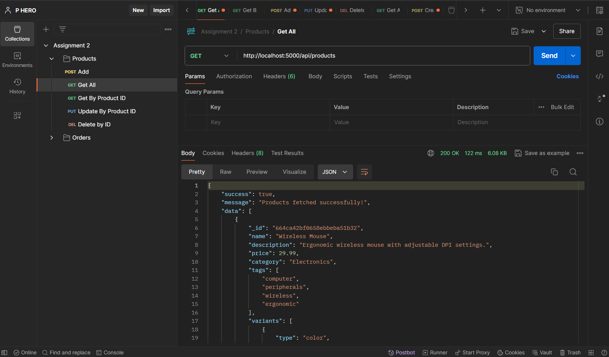
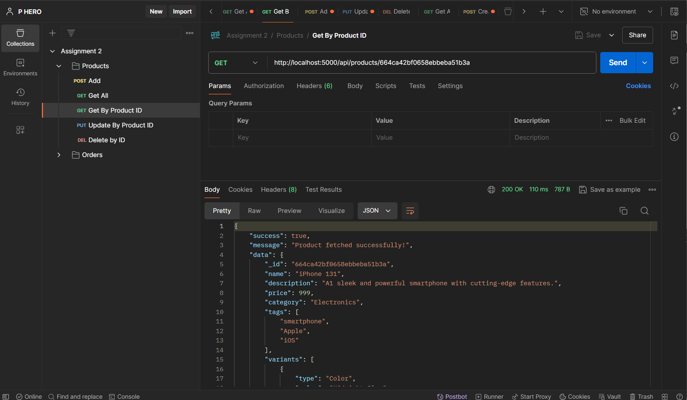
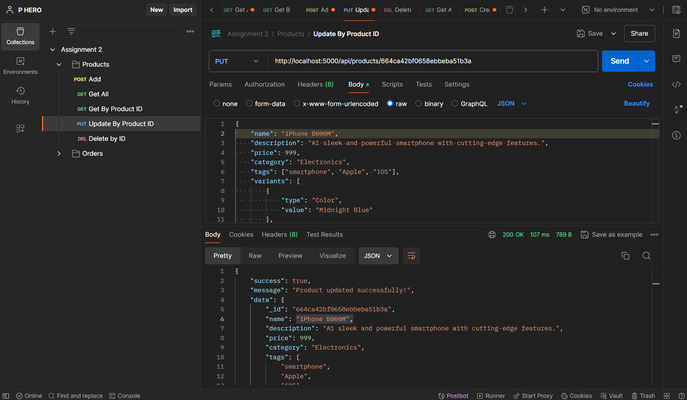
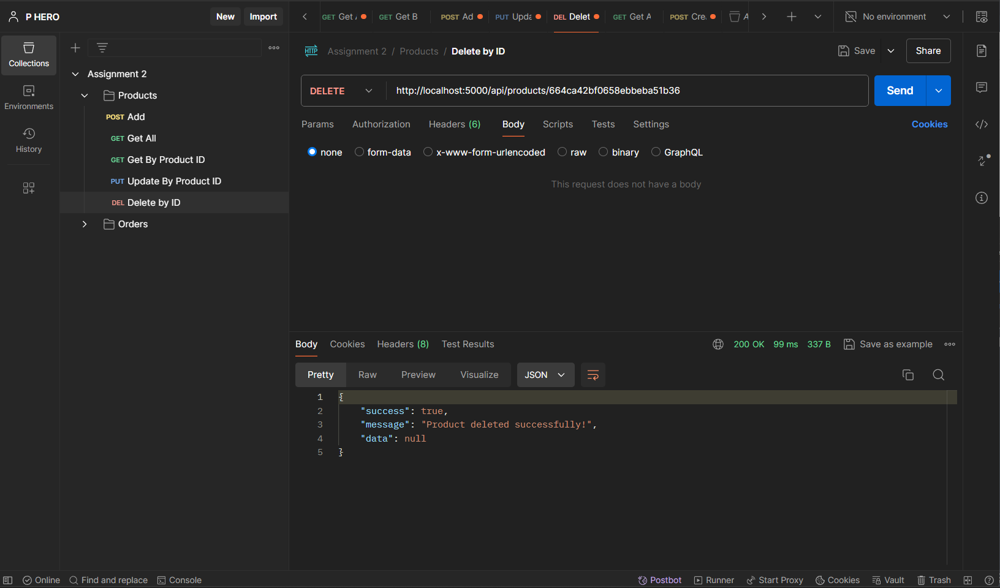
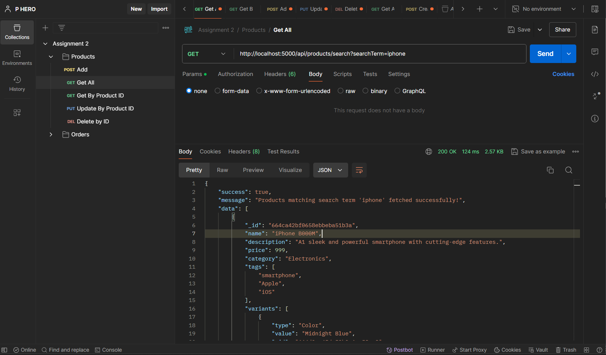
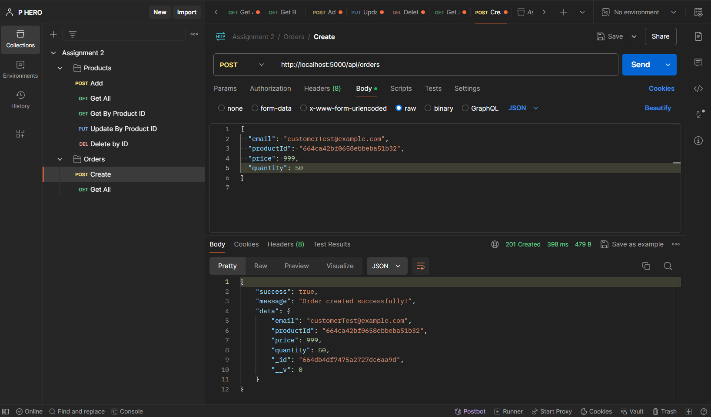
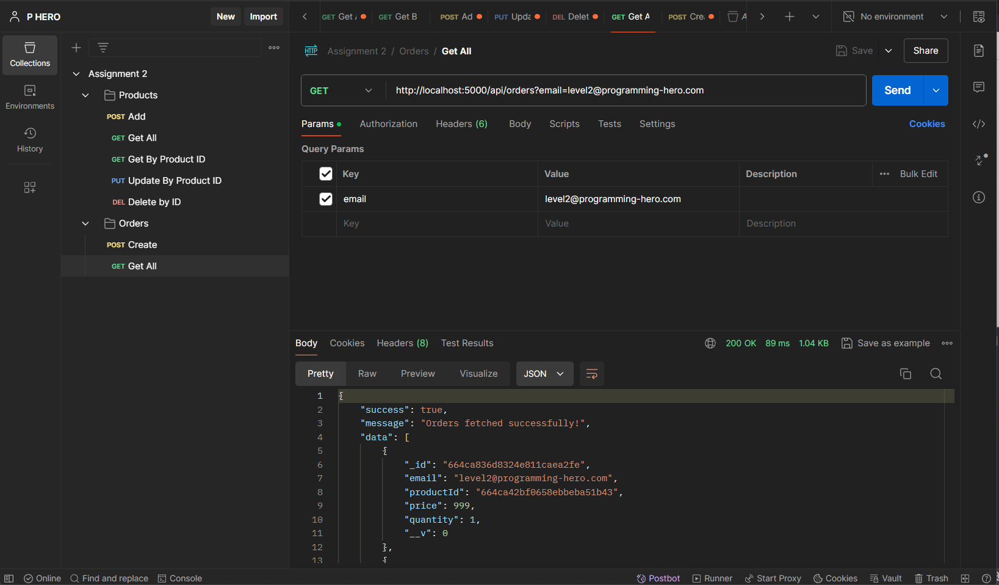

# E-Commerce Backend

This is an E-Commerce backend application developed using Express and TypeScript, integrated with MongoDB using Mongoose for effective data management. The application ensures data integrity through validation using Joi.

## Features

- Create, Retrieve, Update, Delete Products
- Create and Retrieve Orders
- Inventory management with quantity updates on order creation
- Data validation with Joi

## Prerequisites

Make sure you have the following installed on your system:

- Node.js
- npm
- MongoDB

## Project Setup

### 1. Clone the repository

```bash
git clone https://github.com/mrx-arafat/e-commerce-backend.git
cd e-commerce-backend
```

### 2. Install dependencies

```bash
npm install
```

### 3. Environment Variables

Create a `.env` file in the root directory of the project and add the following environment variables:

```env
PORT=5000
DATABASE_URL=mongodb://localhost:27017/arafatDB
```

### 4. Build the Project

To compile the TypeScript code, run:

```bash
npm run build
```

### 5. Seed the Database

To populate the database with sample data, run the feeder script:

```bash
npx ts-node src/feeder.ts
```

### 6. Start the Server

```bash
npm run start
```

This will start the server on the port specified in the `.env` file (default is 5000).

## API Endpoints

### Product Management

#### Create a New Product

- **Endpoint**: `/api/products`
- **Method**: POST
- **Request Body**:

```json
{
  "name": "iPhone 13",
  "description": "A sleek and powerful smartphone with cutting-edge features.",
  "price": 999,
  "category": "Electronics",
  "tags": ["smartphone", "Apple", "iOS"],
  "variants": [
    {
      "type": "Color",
      "value": "Midnight Blue"
    },
    {
      "type": "Storage Capacity",
      "value": "256GB"
    }
  ],
  "inventory": {
    "quantity": 50,
    "inStock": true
  }
}
```

- **Sample Response**:

#### Retrieve All Products

- **Endpoint**: `/api/products`
- **Method**: GET
- **Sample Response**:



#### Retrieve a Specific Product by ID

- **Endpoint**: `/api/products/:productId`
- **Method**: GET
- `http://localhost:5000/api/products/664ca42bf0658ebbeba51b3a`
- **Sample Response**:



#### Update Product Information

- **Endpoint**: `/api/products/:productId`
- **Method**: PUT
- **Sample Request Body**:

**Sample Response**:



#### Delete a Product

- **Endpoint**: `/api/products/:productId`
- **Method**: DELETE
- **Sample Response**:



#### Search a Product

- **Endpoint**: `/api/products/search?searchTerm=iphone`
- `http://localhost:5000/api/products/search?searchTerm=iphone`
- **Method**: GET
- **Sample Response**:



### Order Management

#### Create a New Order

- **Endpoint**: `/api/orders`
- **Method**: POST
- **Request Body**:



- **Sample Response**:

#### Retrieve All Orders

- **Endpoint**: `/api/orders`
- **Method**: GET
- **Sample Response**:

#### Retrieve Orders by User Email

- **Endpoint**: `/api/orders?email=customer@example.com`
- **Method**: GET
- **Sample Response**:



### Bonus Section Done: Inventory Update

When creating a new order via the `/api/orders` endpoint, the system will:

1. Check the available quantity in inventory.
2. Return an error response if the ordered quantity exceeds the available quantity.
3. Update the inventory quantity and `inStock` status based on the ordered quantity.
4. If the inventory quantity reaches zero, set `inStock` to false; otherwise, keep it as true.

### Error Handling

- **Insufficient Quantity Error**:

```json
{
  "success": false,
  "message": "Insufficient quantity available in inventory"
}
```

- **Not Found Error**:

```json
{
  "success": false,
  "message": "Order not found"
}
```

- **Not Found Route**:

```json
{
  "success": false,
  "message": "Route not found"
}
```

### Validation with Joi

Joi is used to validate incoming data for product and order creation and updating operations.

## Developer

[mrx-arafat](https://github.com/mrx-arafat)
